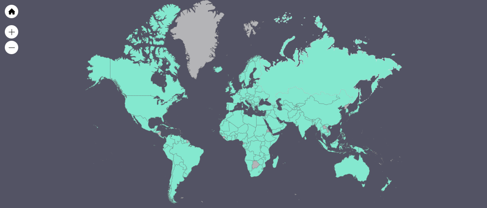
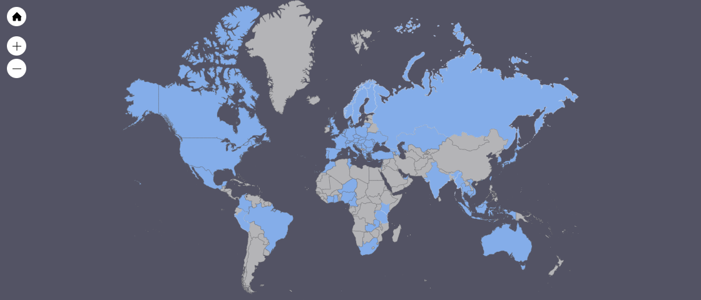

### Hi there 👋
Let's code and grow together.

 

Got download from all over the [world](https://www.amcharts.com/visited_countries/#AL,AM,AT,AZ,BY,BE,BA,BG,HR,CY,CZ,DK,EE,FO,FI,FR,GE,DE,GI,GR,HU,IS,IE,IT,JE,XK,LV,LT,LU,MT,MD,ME,NL,MK,NO,PL,PT,RO,RU,RS,SK,SI,ES,SE,CH,TR,UA,GB,AG,CA,CR,CU,DO,SV,GT,HT,HN,JM,MX,PA,TT,US,AR,BO,BR,CL,CO,EC,GY,PY,PE,SR,UY,VE,DZ,AO,BJ,BF,BI,CM,CV,CF,TD,KM,CI,CD,DJ,EG,SZ,ET,GA,GM,GH,GN,GW,KE,LS,LR,LY,MG,MW,ML,MR,MU,MA,MZ,NA,NE,NG,CG,RW,SN,SO,ZA,SS,SD,TZ,TG,TN,UG,EH,ZM,ZW,AF,BH,BD,BT,KH,CN,HK,IN,ID,IR,IQ,IL,JP,JO,KZ,KW,KG,LB,MY,MN,MM,NP,OM,PK,PS,PH,QA,SA,SG,KR,LK,SY,TW,TJ,TH,TL,TM,AE,UZ,VN,YE,AU,NZ,PG,TL).  

[Countries](https://www.amcharts.com/visited_countries/#AL,AT,AZ,BE,BA,BG,HR,CY,CZ,DK,FI,FR,GE,DE,GR,HU,IT,LT,LU,NL,MK,NO,PL,PT,RO,RU,RS,SK,SI,ES,SE,TR,UA,GB,CA,MX,US,BR,CO,PE,CM,GH,KE,MA,NG,RW,TZ,TN,ZM,HK,IN,ID,IL,JP,KZ,MY,SG,KR,TW,TH,AE,VN,AU
) reached through my paid apps and subscriptions.  
